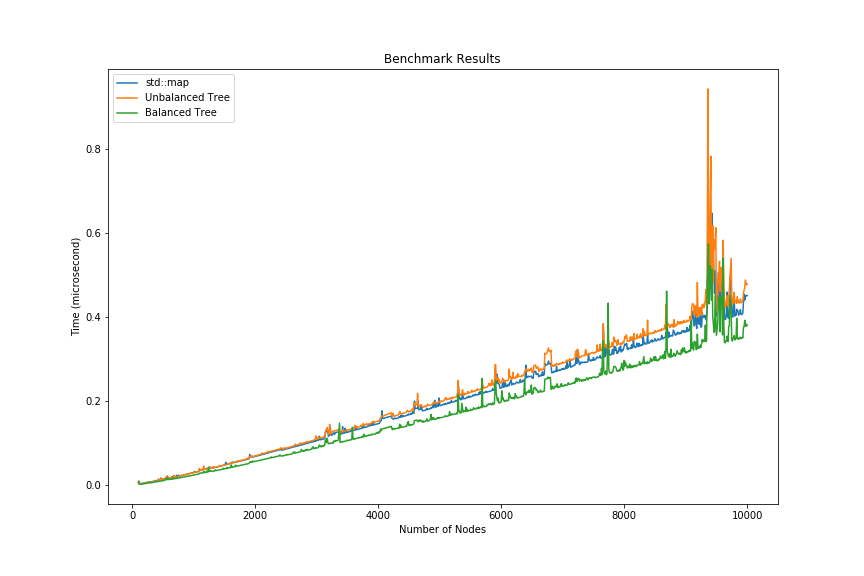

# Binary Search Tree

An implementation of Binary Search Tree data structure with C++

Group members: Eros Fabrici, Dogan Can Demirbilek, Alessandro Scardoni

## Structure of Repository

* `include` which contains the `node.hxx` (implementation of class node), `iterator.hxx` (implementation of iterator class) and `bst.hxx` (implementation of binary search tree and member functions)

* `src` which contains `test.cpp` (test of bst member functions and constructors), `benchmark.cpp` (benchmark of unbalanced, balanced tree and `std::map`)

* `benchmark` which contains python scripts to plot benchmark results

`Makefile` is used to compile the codes inside `src` folder. By typing `make` in terminal, you will have `test.o` and `benchmark.o`

## Report

### Introduction

The aim of project is implementing a template binary search tree (BST) in C++ language. A BST is a hierarchical data structure which allows fast lookup, addition and removal of items. In our implementation, each node stores a pair of a key and the associated value and keys are used to establish a order relation. 

### Structure of Code

There are 3 header files, you can find them in include folder, named as ```bst.hxx, iterator.hxx``` and ```node.hxx```.

* ```node```, implements the node of BST whose members are data which is a ```std::pair```, unique pointers to children and raw pointer to parent. It has constructors given a tuple, given a tuple and pointer to parent node and copy constructor.
* ```iterator```, implements the forward iterator of BST. It has member called current which is a raw pointer to node. It has overloading operators like ```operator*``` which returns pair of key and value, ```operator++``` which advance to the next order, basing inorder traversal.
* ```bst```, implementation of BST. It is templated on the key, value and comparasion operator which is default ```std::less```. Respectively, it has unique pointer to root of tree, private methods that helps to implement the public methods, constructors (default, copy, move etc.) and public methods.


We have created two different scripts that are ```test.cpp``` and ```benchmark.cpp```.
* ```test.cpp```,with this script, we have tested implemented methods like insert, balance, emplace, erase etc. constructors, move and copy semantics.
* ```benchmark.cpp```, with this script, with random elements, we have compared performance of unbalanced tree, balanced tree and std::map.

Lastly, in benchmark folder, we have created python script (jupyter notebook) which plots the result of benchmark.

All scripts tested with valgrind and no memory leak observed.

### Member Functions

#### Insert
Insert a new node to tree and returns a pair of an iterator (pointing to node) and a bool. The bool is true if a new node inserted successfully, false otherwise (i.e., the key was already present in the tree).

#### Emplace
Inserts a new element into the tree in-place with gicen arguments by calling insert function. 

#### Clear
Removes all the nodes of a tree by resetting root of tree.

#### Begin (cbegin) and End (cend)
Begin returns an iterator to left-most node and end returns an iterator to one-past th last element which is a ```nullptr```. These methods provide a starting and stopping conditions to iterator.

#### Find
Given key as an argument, starting from the root of tree, if the key is larger than the current node's key, it will seek on the right, otherwise on the left. If key exist in tree, it returns an iterator to the proper node, ```end()``` otherwise.

#### Balance
Balances the tree by copying all the pairs into a vector from begin to end (in ascending order). After cleaning the tree itself, it calls a ```buildTree()``` recursive function that given a vector of pairs, start and end point calls ```insert()``` on the midpoint and then calls itself twice for left and right side of midpoint. 
There are two helping functions to check if tree is balanced or not by taking root of tree as an argument. ```height``` returns the height of tree and ```isBalanced``` returns 1 if tree is balanced, 0 otherwise.

#### Operator []
Returns a reference to the value that is mapped to a key equivalent to given key as an argument, performing a insertion if such key does not exist.

#### Operator <<
Overloads the operator ```<<``` and printing the key and value for each node from begin to end (in ascending order).

#### Copy and Move
For performing deep-copy we use a private copy function that copy the root of tree and left and rigt subtree recursively. For move, we use ```std::move``` on root of tree.

#### Erase
Removes the element (if one exist) with the key equivalent to key by using successor. It considers three case where node is a leaf, node has only one child and node has two children. 

### Benchmark

In order to measure the look-up performance of our implementation we compare the performance of our find method with unbalanced tree, balanced tree and ```std::map```. We used int random numbers as keys and their string forms as values.
We increase the number of nodes from 100 to 10000 and calculate the average time for finding element in container.



From the plot, it can be observed that unbalanced bst has the worst performance, on the other hand our balanced bst implementation performance is similar to ```std::map``` even a bit faster when number of nodes increased. This can be explained by our simpler implementation may spawn a better optimizations of compiler.
